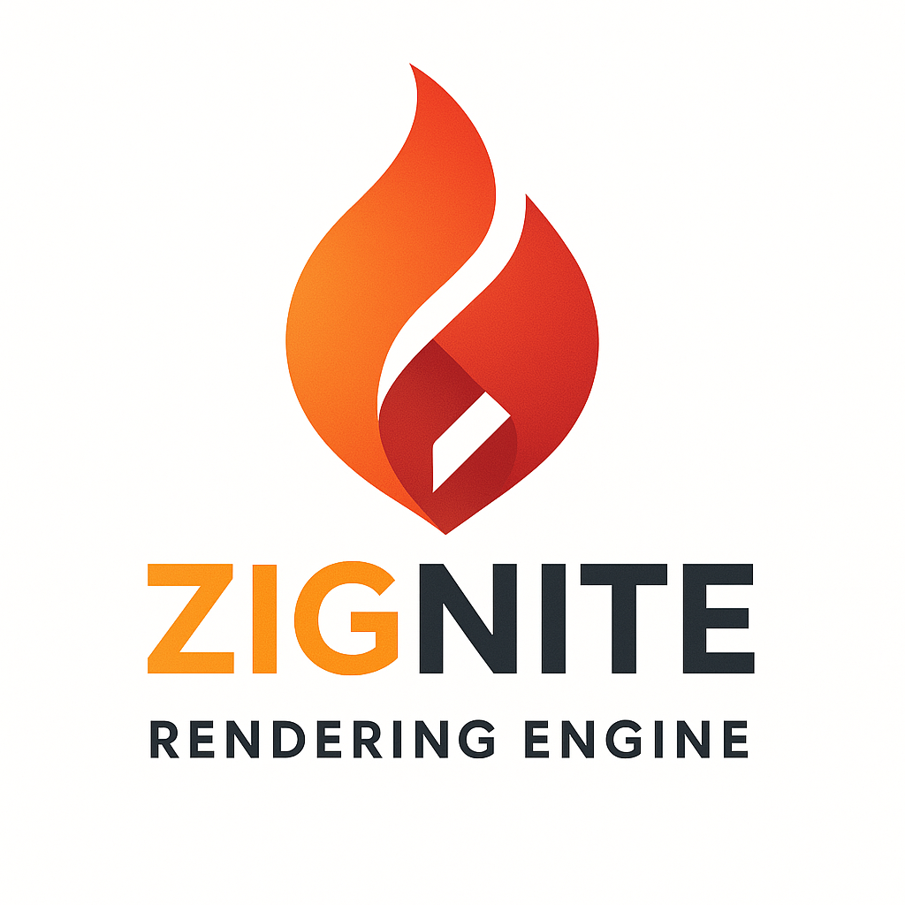
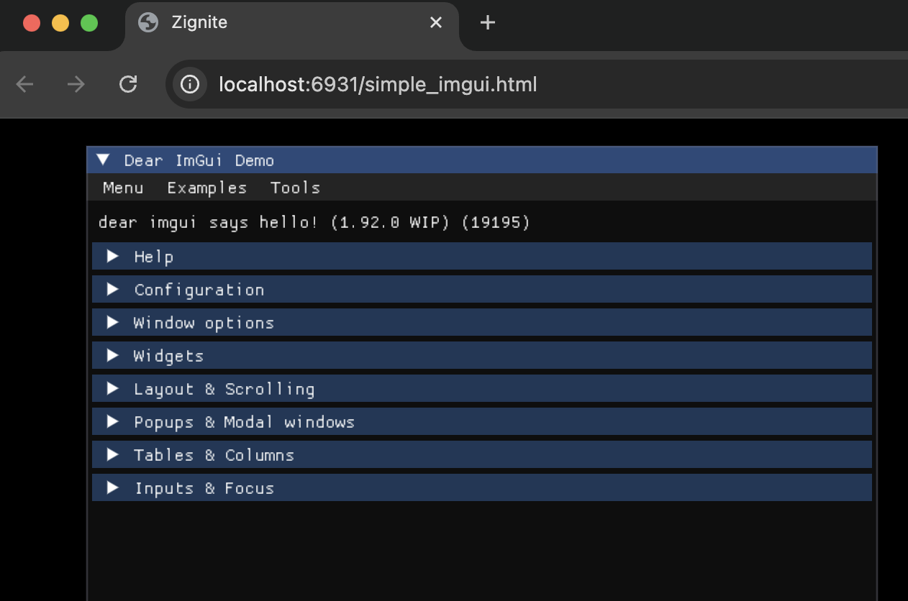
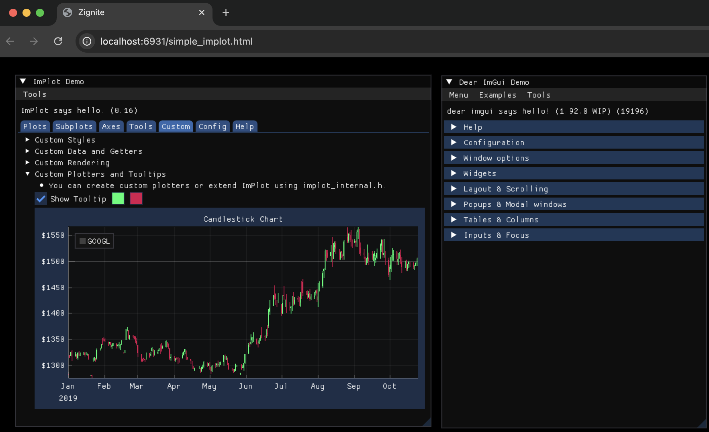

<p align="center">
  
</p>

# Zignite: Cross-Platform Graphics Engine

## Overview

Zignite is a modern graphics engine built with the Zig programming language, designed for cross-platform development with native performance and WebAssembly compatibility. This project leverages Zig's memory safety and performance characteristics to create a robust foundation for interactive applications, games, and visualization tools.

## Getting Started

### Installation

Use fetch:
```bash
zig fetch --save https://github.com/Thomvanoorschot/zignite/archive/main.tar.gz
```

Or add AsyncZocket to your `build.zig.zon`:

```zig
.dependencies = .{
    .async_zocket = .{
        .url = "https://github.com/thomvanoorschot/zignite/archive/main.tar.gz",
        .hash = "...", // Update with actual hash
    },
},
```

### Add to your project

```zig
const std = @import("std");
const zignite = @import("zignite");

pub fn build(b: *std.Build) !void {
    const target = b.standardTargetOptions(.{});
    const optimize = b.standardOptimizeOption(.{});

    // Dependencies
    const zignite_dep = b.dependency("zignite", .{
        .target = target,
        .optimize = optimize,
    });

    // Client module
    const exe_mod = b.addModule("client", .{
        .target = target,
        .optimize = optimize,
        .root_source_file = .{ .cwd_relative = "src/main.zig" },
    });

    // Add imports
    exe_mod.addImport("zignite", zignite_dep.module("zignite"));

    // Add "executable"
    const exe = b.addStaticLibrary(.{
        .name = "Example",
        .root_module = exe_mod,
    });

    // Add imports to executable
    exe.root_module.addImport("zignite", zignite_dep.module("zignite"));


    exe.linkLibC();
    exe.root_module.addImport("zignite", zignite_dep.module("zignite"));

    const emsdk = zignite_dep.builder.dependency("emsdk", .{});
    const link_step = try zignite.emLinkStep(b, .{
        .lib_main = exe,
        .target = target,
        .optimize = optimize,
        .emsdk = emsdk,
        .use_webgpu = true,
        .use_glfw = true,
        .shell_file_path = zignite_dep.path("web/shell.html"),
        .extra_args = &.{
            "-lwebsocket.js",
        },
    });

    b.getInstallStep().dependOn(&link_step.step);

    // Add run step
    const run = zignite.emRunStep(b, .{ .name = "client", .emsdk = emsdk });
    run.step.dependOn(&link_step.step);
    b.step("run", "Run client").dependOn(&run.step);

    b.installArtifact(exe);
}

```

## Goals
• Build a lightweight, high-performance graphics engine using modern APIs \
• Explore Zig's compile-time features and manual memory management capabilities \
• Create seamless cross-platform deployment (native + WebAssembly) \
• Integrate immediate-mode GUI capabilities with Dear ImGui and Dear ImPlot \
• Enable concurrent processing with Web Workers and WebSocket communication \
• Provide a clean, type-safe API for graphics programming \

## Architecture 

Zignite is built around modern graphics APIs and cross-platform libraries: \
• **WebGPU Backend** – Cross-platform graphics API for native and web targets \
• **GLFW Integration** – Window management, input handling, and context creation \
• **Dear ImGui** – Immediate-mode GUI system for developer tools and interfaces \
• **Dear ImPlot** – Advanced plotting library for data visualization and analysis \
• **Web Workers** – Non-blocking concurrent processing with shared memory support \
• **WebSocket Integration** – Real-time communication through web workers \
• **Engine Core** – Unified rendering loop and resource management \
• **Emscripten Support** – WebAssembly compilation for browser deployment

## Features

• Cross-platform rendering with WebGPU (native + web) \
• Memory-efficient implementation with Zig's allocator system \
• Integrated Dear ImGui for rapid UI development \
• Integrated Dear ImPlot for advanced plotting and data visualization \
• Web Worker support for non-blocking background processing \
• WebSocket communication through web workers with shared memory \
• WebAssembly compilation for browser deployment \
• Type-safe graphics API bindings \
• Minimal dependencies and fast compilation times

## Running Examples

The project includes several examples demonstrating engine capabilities:

### Web/WASM Examples

To build and run examples in the browser using WebAssembly:

```bash
# Run the simple ImGui example
zig build run-simple_imgui -Dtarget=wasm32-emscripten

# The example will automatically open in Chrome browser
```

### Available Examples

- **simple_imgui** - Basic ImGui integration with rendering loop
<p align="center">
  
</p>

- **simple_implot** - Basic ImPlot integration with rendering loop
<p align="center">
  
</p>

- **simple_webworker** - Web Worker integration with shared memory for concurrent processing
<p align="center">
  
</p>

- **simple_webworker_websocket** - WebSocket communication through web workers for real-time data

### Prerequisites

- Zig compiler (latest stable version)
- Emscripten SDK (automatically handled by the build system)
- Chrome browser (for running web examples)

The build system will automatically download and configure Emscripten if it's not already installed.

## Learning Outcomes

This project provides hands-on experience with: \
• Zig's comptime features and build system \
• Manual memory management with custom allocators \
• Cross-platform graphics programming with WebGPU \
• C interoperability and binding generation with ImGui/ImPlot \
• Web Worker implementation and shared memory management \
• WebSocket communication in concurrent environments \
• WebAssembly deployment strategies \
• Modern graphics pipeline architecture

## Project Status

🚧 **Active Development** – Core engine functionality is implemented with WebGPU + ImGui + ImPlot integration. WebAssembly deployment is supported via Emscripten.
