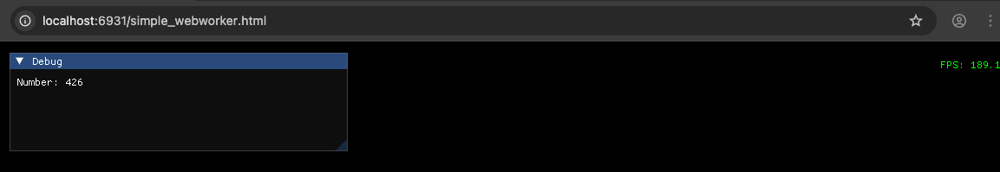

<p align="center">
  
</p>

# Zignite: Cross-Platform Graphics Engine

## Overview

Zignite is a modern graphics engine built with the Zig programming language, designed for cross-platform development with native performance and WebAssembly compatibility. This project leverages Zig's memory safety and performance characteristics to create a robust foundation for interactive applications, games, and visualization tools.

The engine supports two deployment targets:

- **Native Applications** using Dawn Native (currently tested on macOS)
- **Web Applications** using WebGPU via Emscripten/WebAssembly

## Getting Started

### Installation

Use fetch:

```bash
zig fetch --save https://github.com/Thomvanoorschot/zignite/archive/main.tar.gz
```

Or add Zignite to your `build.zig.zon`:

```zig
.dependencies = .{
    .zignite = .{
        .url = "https://github.com/thomvanoorschot/zignite/archive/main.tar.gz",
        .hash = "...", // Update with actual hash
    },
},
```

### Add to your project

```zig
const std = @import("std");
const Build = std.Build;
const zignite_pkg = @import("zignite");

pub fn build(b: *Build) void {
    const target = b.standardTargetOptions(.{});
    const optimize = b.standardOptimizeOption(.{});

    const zignite_dep = b.dependency("zignite", .{
        .target = target,
        .optimize = optimize,
        .with_imgui = true,
        .with_implot = false,
        .use_glfw = true,
        .use_webgpu = true,
        .use_filesystem = false,
    });

    const zignite_lib = zignite_dep.artifact("zignite");

    const example_names = .{
        "simple_imgui",
        "simple_implot",
        "simple_webworker",
        "simple_webworker_websocket",
    };

    inline for (example_names) |example_name| {
        const example_mod = b.addModule(example_name, .{
            .target = target,
            .optimize = optimize,
            .root_source_file = b.path(example_name ++ ".zig"),
        });

        // Handle both native and web targets
        if (target.query.os_tag == .emscripten) {
            // Web/WASM build
            const example = b.addStaticLibrary(.{
                .name = example_name,
                .root_module = example_mod,
            });

            example.linkLibrary(zignite_lib);
            example.linkLibC();
            example.root_module.addImport("zignite", zignite_dep.module("zignite"));

            _ = zignite_pkg.emRunStep(b, .{
                .name = example_name,
                .zignite_dep = zignite_dep,
                .lib_main = example,
            });
        } else {
            // Native build
            const example = b.addExecutable(.{
                .name = example_name,
                .root_module = example_mod,
            });
            example.root_module.addImport("zignite", zignite_dep.module("zignite"));
            b.installArtifact(example);

            const run = b.addRunArtifact(example);
            b.step(example_name, "Run " ++ example_name).dependOn(&run.step);
        }
    }
}
```

## Goals

• Build a lightweight, high-performance graphics engine using modern APIs \
• Explore Zig's compile-time features and manual memory management capabilities \
• Create seamless cross-platform deployment (native + WebAssembly) \
• Integrate immediate-mode GUI capabilities with Dear ImGui and Dear ImPlot \
• Enable concurrent processing with Web Workers and WebSocket communication \
• Provide a clean, type-safe API for graphics programming \

## Architecture

Zignite is built around modern graphics APIs and cross-platform libraries:

### Core Graphics

• **WebGPU Backend** – Cross-platform graphics API for native and web targets \
• **Dawn Native** – Google's native WebGPU implementation for desktop applications \
• **GLFW Integration** – Window management, input handling, and context creation \

### UI & Visualization

• **Dear ImGui** – Immediate-mode GUI system for developer tools and interfaces \
• **Dear ImPlot** – Advanced plotting library for data visualization and analysis \

### Web Features

• **Web Workers** – Non-blocking concurrent processing with shared memory support \
• **WebSocket Integration** – Real-time communication through web workers \
• **Emscripten Support** – WebAssembly compilation for browser deployment \

### Engine Core

• **Engine Core** – Unified rendering loop and resource management \
• **Cross-Platform Abstraction** – Single codebase for native and web deployment

## Features

### Cross-Platform Rendering

• Native desktop applications using Dawn Native (macOS tested, Windows/Linux support planned) \
• Web applications using WebGPU via Emscripten/WebAssembly \
• Unified API for both deployment targets

### Web-Specific Features

• Web Worker support for non-blocking background processing \
• WebSocket communication through web workers with shared memory \
• WebAssembly compilation for browser deployment

## Running Examples

The project includes several examples demonstrating engine capabilities for both native and web platforms.

### Prerequisites

#### For Native Development (macOS)

- GLFW library (for now install via Homebrew: `brew install glfw`)

### Native Examples

To build and run examples as native applications:

```bash
# Build and run the simple ImGui example natively
zig build simple_imgui

# Build and run the simple ImPlot example natively
zig build simple_implot

# Build and run the web worker example natively
zig build simple_webworker

# Build and run the WebSocket web worker example natively
zig build simple_webworker_websocket
```

### Web/WASM Examples

To build and run examples in the browser using WebAssembly:

```bash
# Run the simple ImGui example in browser
zig build simple_imgui -Dtarget=wasm64-emscripten

# Run the simple ImPlot example in browser
zig build simple_implot -Dtarget=wasm64-emscripten

# Run the web worker example in browser
zig build simple_webworker -Dtarget=wasm64-emscripten

# Run the WebSocket web worker example in browser
zig build simple_webworker_websocket -Dtarget=wasm64-emscripten

# The examples will automatically open in Chrome browser
```

### Available Examples

- **simple_imgui** - Basic ImGui integration with rendering loop
<p align="center">
  
</p>

- **simple_implot** - Basic ImPlot integration with rendering loop
<p align="center">
  
</p>

- **simple_webworker** - Web Worker integration with shared memory for concurrent processing
<p align="center">
  
</p>

- **simple_webworker_websocket** - WebSocket communication through web workers for real-time data
<p align="center">
  
</p>

### Platform Support

| Platform | Status     | Notes                            |
| -------- | ---------- | -------------------------------- |
| macOS    | ✅ Tested  | Full Dawn Native support         |
| Windows  | 🚧 Planned | Dawn Native support coming       |
| Linux    | 🚧 Planned | Dawn Native support coming       |
| Web      | ✅ Stable  | Full WebGPU + Emscripten support |

## Learning Outcomes

This project provides hands-on experience with: \
• Zig's comptime features and build system \
• Manual memory management with custom allocators \
• Cross-platform graphics programming with WebGPU \
• Native graphics development with Dawn Native \
• C interoperability and binding generation with ImGui/ImPlot \
• Web Worker implementation and shared memory management \
• WebSocket communication in concurrent environments \
• WebAssembly deployment strategies \
• Modern graphics pipeline architecture \
• Cross-platform build system design

## Project Status

🚧 **Active Development** – Core engine functionality is implemented with WebGPU + ImGui + ImPlot integration. Native desktop deployment via Dawn Native is working on macOS, with WebAssembly deployment supported via Emscripten. Windows and Linux native support are planned for future releases.
